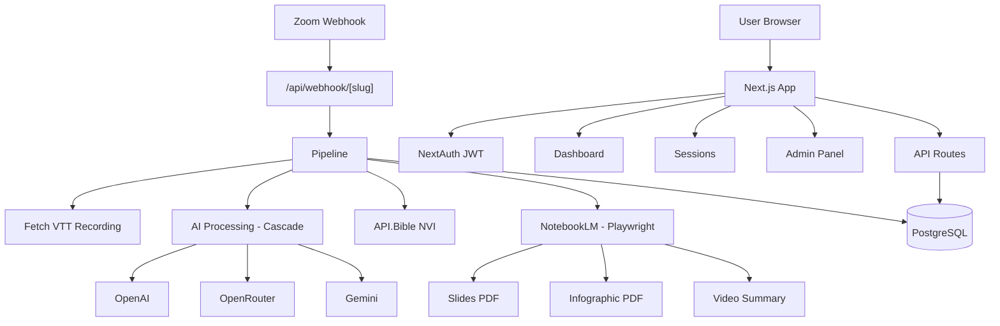

## Notas de Arquitetura

Este documento descreve a arquitetura do sistema DevocionalHub, padrões de design e decisões técnicas relevantes.

Para contagem completa de símbolos e análise de dependências, veja [`codebase-map.json`](./codebase-map.json).

## Visão Geral da Arquitetura

**Estilo de Arquitetura**: Monólito Modular (arquitetura baseada em features)

**Framework**: Next.js 16 App Router (SSR + API Routes)

O DevocionalHub é organizado em camadas bem definidas, onde cada domínio de negócio é isolado dentro da pasta `src/features/`, promovendo alta coesão e baixo acoplamento entre funcionalidades.

## Camadas Arquiteturais

### 1. Camada de Roteamento (`src/app/`)

Páginas e 23 endpoints de API organizados com Route Groups do Next.js:

- **`(auth)/`** — Páginas públicas (login, convite) sem sidebar
- **`(dashboard)/`** — Páginas autenticadas com layout compartilhado (sidebar)
- **`api/`** — Endpoints REST para toda a comunicação backend

#### Tabela de Rotas

| Rota | Arquivo | Descrição |
|------|---------|-----------|
| `/` | `(dashboard)/page.tsx` | Dashboard com stats, hero, insights IA, calendário |
| `/books` | `(dashboard)/books/page.tsx` | Livros da Bíblia (lista lateral + grid cards azuis) |
| `/reports` | `(dashboard)/reports/page.tsx` | Relatórios com filtros, gráfico e tabela |
| `/profile` | `(dashboard)/profile/page.tsx` | Perfil do usuário |
| `/admin` | `(dashboard)/admin/page.tsx` | Painel admin (7 abas com ícones) |
| `/session/[id]` | `(dashboard)/session/[id]/page.tsx` | Detalhe da sessão |
| `/login` | `(auth)/login/page.tsx` | Login |

### 2. Camada de Features (`src/features/`)

Domínios de negócio isolados, cada um com seus próprios componentes e libs:

- **`auth/`** — Autenticação (NextAuth v5, JWT)
- **`sessions/`** — Sessões e controle de presença
- **`pipeline/`** — Orquestração de processamento (IA, VTT, NotebookLM)
- **`zoom/`** — Integração Zoom (OAuth, gravações, participantes)
- **`bible/`** — Textos bíblicos (API.Bible NVI) — componentes: BooksPageClient (novo), BibleBooksGrid (legado)
- **`email/`** — Envio de emails (Gmail SMTP via Nodemailer)
- **`admin/`** — Painel administrativo
- **`dashboard/`** — Componentes do dashboard (calendário, stats, hero, insights IA)

### 3. Camada Compartilhada (`src/shared/`)

Código transversal utilizado por múltiplas features:

- **`components/`** — Sidebar, Badge e componentes de UI reutilizáveis
- **`lib/`** — `db.ts` (Prisma singleton), `storage.ts`, `utils.ts`

### 4. Camada de Dados

- **Prisma 5** como ORM
- **PostgreSQL 16** como banco de dados relacional

> Veja [`codebase-map.json`](./codebase-map.json) para contagem completa de símbolos e grafos de dependência.

## Padrões de Design Identificados

| Padrão | Localização | Descrição |
|--------|-------------|-----------|
| Arquitetura baseada em Features | `src/features/` | Cada domínio isolado com seus próprios componentes e libs |
| Cascata/Fallback | `pipeline/lib/ai.ts` | Cascata de provedores de IA (OpenAI → OpenRouter → Gemini) |
| Pipeline orientado a Webhooks | `pipeline/lib/pipeline.ts` | Zoom `meeting.ended` dispara pipeline completo de processamento |
| Singleton | `shared/lib/db.ts` | Prisma Client singleton via padrão `globalThis` |
| Autenticação JWT | `features/auth/` | NextAuth v5 com estratégia JWT |
| Route Groups | `app/(auth)`, `app/(dashboard)` | Isolamento de layouts via agrupamento de rotas do Next.js |

## Pontos de Entrada

- **`src/app/layout.tsx`** — Root layout (fonte, script de tema)
- **`src/app/(dashboard)/layout.tsx`** — Layout autenticado com Sidebar + verificação de auth
- **`src/app/api/`** — 23 endpoints REST
- **`src/middleware.ts`** — Middleware de autenticação

## Fluxo de Requisição (Pipeline)

O pipeline é o coração do sistema, ativado automaticamente quando uma reunião Zoom termina:

1. Webhook Zoom (`meeting.ended`) → `POST /api/webhook/[slug]`
2. Validação do segredo do webhook → dispara pipeline
3. **Pipeline de processamento**:
   - Baixa gravação VTT do Zoom
   - Processamento via IA (cascata de provedores)
   - Busca texto bíblico NVI via API.Bible
   - Automação NotebookLM via Playwright (slides, infográfico, vídeo resumo)
   - Salva resultados no banco de dados
4. **Sincronização de presença**: correlaciona participantes do Zoom com usuários cadastrados via `ZoomIdentifier`

## Fronteiras Internas do Sistema

Cada feature em `src/features/` representa um bounded context com responsabilidades bem definidas:

- **Pipeline** é o domínio mais complexo — orquestra chamadas para Zoom, IA, Bible e NotebookLM
- **Sessions** possui os dados de sessões e presença, consumidos pelo Dashboard
- **Auth** gerencia identidade e tokens, utilizado por todas as rotas protegidas
- **Zoom** encapsula toda a comunicação com a API do Zoom (OAuth Server-to-Server)

## Dependências Externas

- **Zoom API** (OAuth Server-to-Server) — gravações e lista de participantes
- **OpenAI API** — processamento primário de IA (modelo configurável via admin)
- **OpenRouter API** — modelos gratuitos de fallback (Nemotron, Step)
- **Google Gemini API** — fallback final na cascata de IA
- **API.Bible** — busca de textos bíblicos na versão NVI
- **NotebookLM** (automação via Playwright) — geração de slides, infográfico e vídeo resumo
- **Gmail SMTP** (Nodemailer) — envio de emails de convite

## Decisões Técnicas e Trade-offs

### 1. Arquitetura baseada em Features (vs. baseada em Camadas)
- **Decisão**: Organizar código por domínio de negócio, não por tipo técnico
- **Contexto**: Facilita localização de código e mantém coesão
- **Consequência**: Cada feature é autocontida com componentes + libs próprios

### 2. NextAuth v5 beta
- **Decisão**: Usar versão beta do NextAuth
- **Contexto**: Necessário para compatibilidade total com App Router do Next.js
- **Consequência**: Requer `--legacy-peer-deps` no npm install

### 3. Saída Docker standalone
- **Decisão**: Usar `output: 'standalone'` do Next.js
- **Contexto**: Otimizar tamanho da imagem Docker para produção
- **Consequência**: Imagem significativamente menor e mais rápida para deploy

### 4. Design System v3 com CSS custom properties (vs. Tailwind @theme)
- **Decisão**: Usar Design System v3 com CSS custom properties padrão em `globals.css`
- **Contexto**: `@theme inline` do Tailwind v4 não funciona em produção Docker
- **Consequência**: Mais confiável, funciona em qualquer ambiente. Cores SEMPRE via `var()`, NUNCA hardcoded em componentes

### 5. Debian bookworm (vs. Alpine)
- **Decisão**: Usar imagem base Debian bookworm no Docker
- **Contexto**: Chromium do Playwright é incompatível com Alpine Linux
- **Consequência**: Imagem levemente maior, porém compatível com Playwright

## Diagrama

## Diretórios Principais

- `src/app/` — Camada de roteamento (páginas + API routes)
- `src/features/` — Domínios de negócio isolados
- `src/shared/` — Código compartilhado entre features
- `prisma/` — Schema do banco de dados

*Veja [`codebase-map.json`](./codebase-map.json) para contagem detalhada de arquivos.*

## Recursos Relacionados

- [Visão Geral do Projeto](./project-overview.md)
- [Fluxo de Dados](./data-flow.md)
- [Mapa do Codebase](./codebase-map.json)
